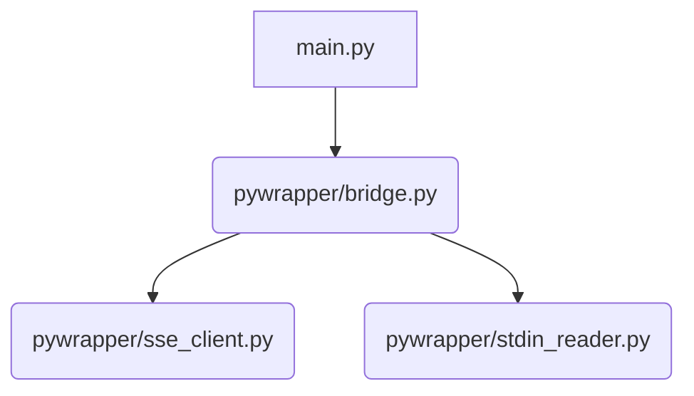
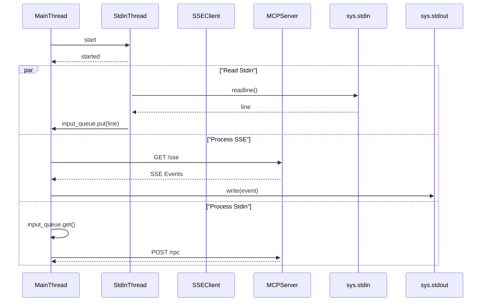

### MCP Stdio wrapper arount MCP SSE server

This utility serves as a transport adapter for the Model Context Protocol (MCP). 
It allows MCP clients that only support Stdio (standard input/output) to communicate with 
MCP servers that use SSE (Server-Sent Events) over HTTP.

## Mechanism

The bridge operates by mapping two different communication protocols:

    * Inbound: It reads JSON-RPC messages from stdin and forwards them to the remote server via HTTP POST requests.

    * Outbound: It listens to the remote SSE stream and writes the incoming data events directly to stdout.

The script uses a background thread to monitor stdin and an asynchronous loop for the HTTP traffic. 
It automatically extracts the required POST endpoint from the initial SSE handshake as defined in the MCP specification.

## Collaboration Diagram

## Sequence Diagram

