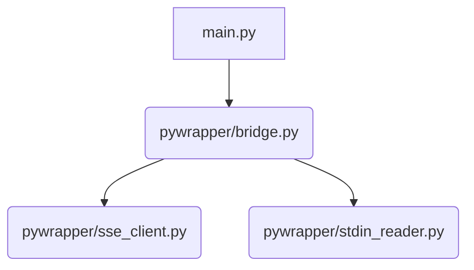
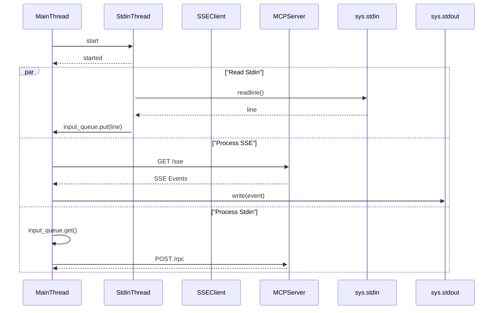

## Mermaid Diagram

```mermaid
graph TD
    A[main.py] --> B(pywrapper/bridge.py);
    B --> C(pywrapper/sse_client.py);
    B --> D(pywrapper/stdin_reader.py);
```

## Sequence Diagram

```mermaid
sequenceDiagram
    participant MainThread
    participant StdinThread
    participant SSEClient
    participant MCPServer

    MainThread->>StdinThread: start
    activate StdinThread
    StdinThread-->>MainThread: started

    par "Read Stdin"
        StdinThread->>sys.stdin: readline()
        sys.stdin-->>StdinThread: line
        StdinThread->>MainThread: input_queue.put(line)
    and "Process SSE"
        MainThread->>MCPServer: GET /sse
        activate MCPServer
        MCPServer-->>MainThread: SSE Events
        MainThread->>sys.stdout: write(event)
    and "Process Stdin"
        MainThread->>MainThread: input_queue.get()
        MainThread->>MCPServer: POST /rpc
        MCPServer-->>MainThread: 
    end
```
